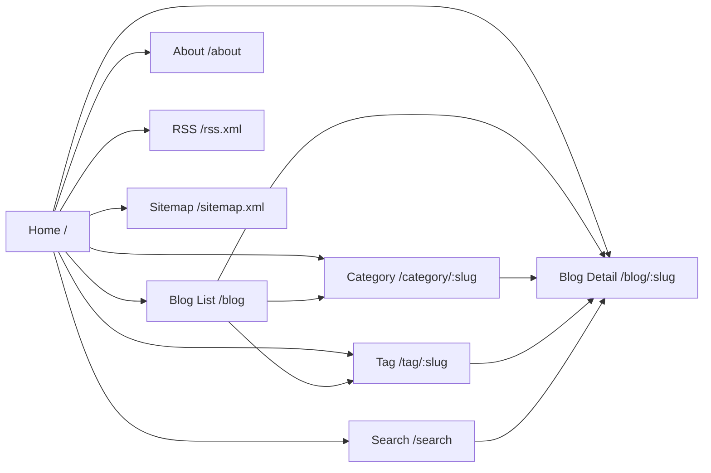
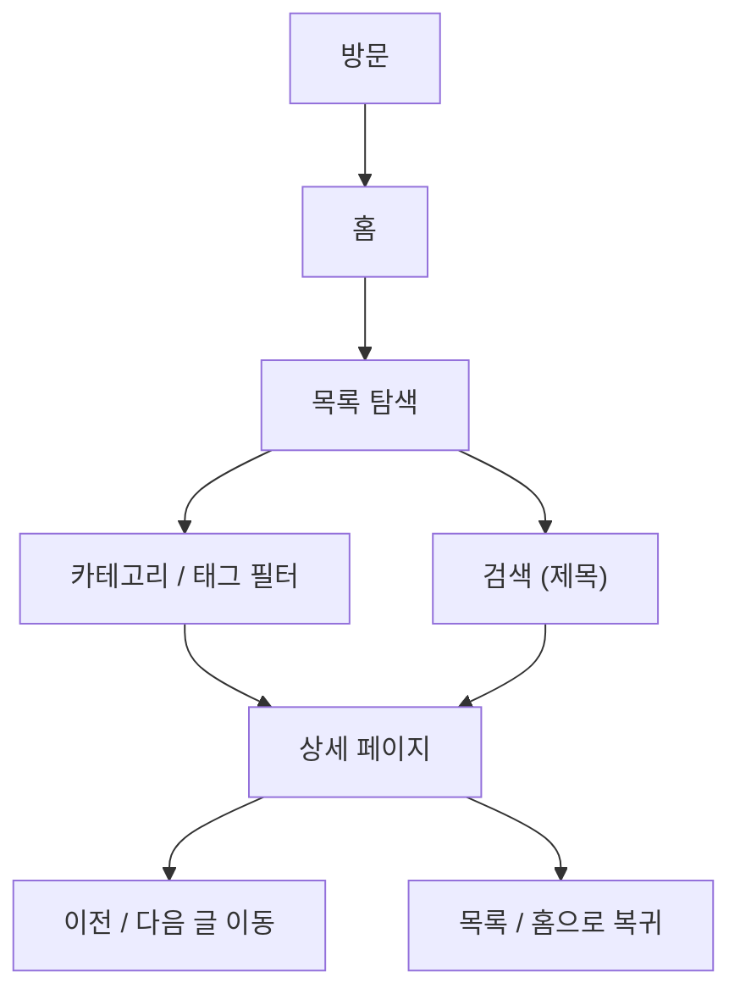

# Blog Website Development Plan

대상: 개발자 기술 블로그

목표: 콘텐츠 소비 경험과 SEO 유입을 최우선으로 하는 정적 사이트 지향 블로그를 설계한다.

가정:

- 콘텐츠는 마크다운 파일로 관리한다.
- 기본 언어는 한국어이며, UI 번역만 지원한다.
- 구현은 `Vite + HTML/CSS/Vanilla JS` 기반의 SSG 지향 구조를 따른다.

### 확정된 결정

| 항목             | 결정                                                   | 비고                           |
| ---------------- | ------------------------------------------------------ | ------------------------------ |
| 콘텐츠 소스      | 마크다운 파일 (`content/posts/*.md`)                   | frontmatter + 본문 구조        |
| 검색 범위        | 제목만 (`title` 필드 대상)                             | Fuse.js 또는 단순 string match |
| 다국어 범위      | UI 번역만                                              | `content/locales/` 키-값 JSON  |
| SNS 공유         | 없음                                                   | Share 버튼 미구현              |
| 테마             | 라이트 모드 전용                                       | 다크모드 미구현                |
| SEO 범위         | `title`, `description`, `canonical`, OG, Twitter Card  | schema.org 구조화 데이터 제외  |
| 상세 페이지 구성 | 제목, 작성자, 작성일, 카테고리, 본문, 이전/다음 글     | TOC, 공유, 관련글 미구현       |
| 목표             | Lighthouse 패스 (Performance/Accessibility/SEO 각 90+) | 저예산 스택, 외부 의존 최소화  |

---

## Step 1. 요구사항 분석

| 구분        | 내용                                                                                         | 이유 / 영향                                                        |
| ----------- | -------------------------------------------------------------------------------------------- | ------------------------------------------------------------------ |
| 확장성 고려 | 콘텐츠 소스는 파일 기반으로 분리하고, 메타데이터와 본문을 느슨하게 결합한다.                 | 목록, 상세, 태그, 카테고리, RSS, sitemap을 재사용하기 쉽다.        |
| 확장성 고려 | URL 규칙을 초기에 고정한다. 예: `/`, `/blog`, `/blog/:slug`, `/category/:slug`, `/tag/:slug` | SEO와 링크 안정성을 확보한다.                                      |
| 확장성 고려 | 공통 UI를 컴포넌트 단위로 분리한다.                                                          | 향후 상세 템플릿, 추천 영역, 작가 정보, 광고/배너 확장에 유리하다. |
| 확장성 고려 | i18n 키와 콘텐츠 언어를 분리한다.                                                            | UI 번역과 콘텐츠 번역의 독립성이 생긴다.                           |
| 확장성 고려 | 검색 인덱스를 빌드 타임에 생성한다.                                                          | 런타임 파싱 없이 지연 로딩만으로 확장 가능하다.                    |
| 확장성 고려 | SEO 메타 생성 함수를 단일 모듈로 분리한다.                                                   | 추후 schema.org 추가 시 한 곳만 수정하면 된다.                     |
| 확장성 고려 | 댓글, 추천 글, 시리즈, TOC는 컴포넌트 슬롯으로 예약한다.                                     | 현재 구현하지 않지만 레이아웃에 자리를 비워둔다.                   |
| 확장성 고려 | 다크모드는 CSS 토큰 구조만 준비한다.                                                         | 추후 다크모드 추가 시 토큰 값 변경만 필요하다.                     |

---

## Step 1.5. 콘텐츠 스키마

마크다운 파일의 frontmatter 기준 스키마 정의.

```yaml
---
title: string # 필수. 페이지 title, OG title에 사용
slug: string # 필수. URL 경로 /blog/:slug
excerpt: string # 필수. 목록 카드 요약, description fallback
category: string # 필수. 단일 카테고리
tags: string[] # 선택. 복수 태그
coverImage: string # 선택. 상대 경로 또는 URL
publishedAt: string # 필수. ISO 8601 (예: 2024-01-15)
updatedAt: string # 선택. ISO 8601
author: string # 필수. 작성자 이름
readingTime: number # 선택. 분 단위 (빌드 타임 자동 계산 가능)
description: string # 선택. 명시적 SEO description. 없으면 excerpt 사용
canonical: string # 선택. 외부 원문 URL이 있을 때만 명시
draft: boolean # 기본 false. true면 빌드에서 제외
---
```

### 파싱 파이프라인

```
content/posts/*.md
  → gray-matter (frontmatter 파싱)
  → marked 또는 unified (마크다운 → HTML)
  → 빌드 스크립트가 HTML 파일에 주입
  → dist/ 정적 파일 출력
```

### 검색 인덱스 형식

빌드 타임에 `dist/search-index.json` 생성. 제목 검색만 필요하므로 본문 제외.

```json
[
  {
    "slug": "my-post",
    "title": "제목 텍스트",
    "category": "JS",
    "publishedAt": "2024-01-15"
  }
]
```

---

## Step 2. 정보 구조(IA)

### Sitemap



### User Flow



### Navigation Structure

- Global Header
  - Logo
  - Home
  - Blog
  - Search
  - Language Switcher (UI 번역 전환)
- Primary Content
  - Hero / featured article
  - Recent posts
  - Category highlights
  - Popular tags
- Article Detail
  - 제목
  - 작성자 / 작성일 / 카테고리
  - 본문
  - 이전 글 / 다음 글
- Footer
  - About
  - RSS
  - Sitemap
  - Copyright

---

## Step 3. 디자인 시스템

### Typography

- 기본 UI 서체: `Pretendard Variable`
- 본문 서체: `Pretendard Variable`
- 코드 서체: `IBM Plex Mono`
- 헤딩 규칙
  - `h1`: 40-48px / 1.1
  - `h2`: 28-32px / 1.2
  - `h3`: 22-24px / 1.25
  - `body`: 16-18px / 1.7
  - `caption`: 13-14px / 1.5
- 원칙
  - 본문은 긴 문장 가독성을 우선한다.
  - 줄 길이는 60~80자 내외를 목표로 한다.
  - 숫자/날짜/코드는 monospaced 스타일을 허용한다.

### Color System (Light Mode)

- `bg`: `#FAFAF8`
- `surface`: `#FFFFFF`
- `surface-alt`: `#F2F2EF`
- `text`: `#1F2328`
- `text-muted`: `#5B6470`
- `border`: `#D9DDE3`
- `accent`: `#2563EB`
- `accent-strong`: `#1D4ED8`
- `success`: `#15803D`
- `warning`: `#B45309`
- `danger`: `#B91C1C`

색상 토큰은 CSS 변수로 관리해 다크모드 추가 시 `:root[data-theme="dark"]` 오버라이드만 추가하면 된다.

### Spacing Scale

- 4px 기반 스케일 사용
- 토큰 예시
  - `space-1`: 4
  - `space-2`: 8
  - `space-3`: 12
  - `space-4`: 16
  - `space-5`: 20
  - `space-6`: 24
  - `space-8`: 32
  - `space-10`: 40
  - `space-12`: 48
  - `space-16`: 64

### Grid System

- Desktop: 최대 콘텐츠 폭 `1200px`
- Main content: `12 column` grid
- Gutter: `24px`
- Mobile: `4 column` 또는 단일 컬럼
- Article reading width: `680px` 내외

### Breakpoints

- `sm`: 480px
- `md`: 768px
- `lg`: 1024px
- `xl`: 1280px
- `2xl`: 1440px

### Component Rules

- Semantic HTML 우선
- 버튼은 행동, 링크는 이동에만 사용
- 카드 전체를 무조건 클릭 영역으로 만들지 않는다
- 이미지에는 `width`/`height`를 명시해 CLS를 줄인다
- 상태는 `hover`, `focus-visible`, `active`, `disabled`를 모두 정의한다
- 아이콘은 장식용이면 `aria-hidden="true"`를 사용한다
- 검색 UI는 키보드로 완결 가능해야 한다
- 공통 컴포넌트: `Header`, `Footer`, `BlogCard`, `TagPill`, `Pagination`, `Breadcrumb`, `SearchField`

---

## Step 4. 폴더 구조

```txt
src/
  content/
    posts/          # 마크다운 글 파일
    authors/        # 작성자 정보 (JSON)
    categories/     # 카테고리 정보 (JSON)
    tags/           # 태그 정보 (JSON)
    locales/        # UI 번역 키-값 (ko.json, en.json 등)
  components/
    common/         # Header, Footer, Pagination, Breadcrumb
    blog/           # BlogCard, TagPill, PostMeta, PrevNext
    seo/            # MetaHead 생성 유틸
    forms/          # SearchField
  layouts/          # 페이지 공통 골격 (base, article)
  pages/
    index.html
    blog/
    category/
    tag/
    search/
    about/
  styles/
    tokens/         # CSS 변수 정의
    base/           # reset, typography
    components/     # 컴포넌트별 스타일
    utilities/      # 헬퍼 클래스
  scripts/
    search/         # 제목 검색 로직
    analytics/      # 분석 연동 (선택)
  assets/
    images/
    icons/
    fonts/
  data/             # 네비게이션, 사이트 설정, 정적 인덱스
  lib/              # 빌드 헬퍼, 메타 생성기
  types/            # JSDoc 타입 선언
  generators/       # sitemap, RSS, search-index 생성 스크립트
```

### 폴더 역할

- `content/`
  - 글과 관련된 원천 데이터를 저장한다.
  - SSG 생성의 기준이 된다.
- `components/`
  - 재사용 UI를 모은다.
  - 공통, 블로그 전용, SEO 전용으로 분리한다.
- `layouts/`
  - 페이지 공통 골격을 정의한다.
  - header/footer/meta 영역을 담당한다.
- `pages/`
  - 실제 라우트가 되는 HTML 템플릿을 둔다.
- `styles/`
  - 디자인 토큰, base, component, utility 스타일을 분리한다.
- `scripts/`
  - 검색, 분석 등 최소 JS 기능을 둔다.
- `assets/`
  - 이미지, 아이콘, 폰트 등 정적 자산을 둔다.
- `data/`
  - 네비게이션, 사이트 설정, 정적 인덱스 데이터를 둔다.
- `lib/`
  - 빌드 헬퍼, 메타 생성기, RSS/Sitemap 생성 로직을 둔다.
- `types/`
  - JSDoc 타입 선언을 둔다. TypeScript 전환 시 `.d.ts`로 교체한다.
- `generators/`
  - sitemap, RSS, search-index 생성기 스크립트를 둔다.

---

## Step 5. 구현 계획

작은 단위로 쪼개고, 각 단계가 독립 실행 가능하도록 배치한다.

| 순서 | 작업                                           | 독립 실행 기준                     | 완료 기준                                                       |
| ---- | ---------------------------------------------- | ---------------------------------- | --------------------------------------------------------------- |
| 1    | 프로젝트 기본 설정                             | Vite 설정과 경로 규칙만 필요       | 빌드 가능한 상태                                                |
| 2    | 콘텐츠 스키마 정의 및 마크다운 파이프라인 구성 | `gray-matter` + `marked` 설치      | `.md` → HTML 변환 가능                                          |
| 3    | 디자인 토큰 정의                               | 스타일 파일만 필요                 | 컬러/타이포/간격 CSS 변수 확보                                  |
| 4    | Base Layout 생성                               | 공통 레이아웃만 필요               | 모든 페이지가 동일 골격 사용                                    |
| 5    | Header 구현                                    | 레이아웃 + 토큰 필요               | 네비게이션 표시, Language Switcher 포함                         |
| 6    | Footer 구현                                    | 레이아웃 + 토큰 필요               | About / RSS / Sitemap 링크                                      |
| 7    | Home 구현                                      | 목록 데이터 샘플 필요              | 최근 글 목록 표시                                               |
| 8    | Blog Card 구현                                 | 카드 데이터 샘플만 있으면 가능     | 목록에 재사용 가능                                              |
| 9    | Blog List 페이지 구현                          | 카드 컴포넌트 필요                 | 페이지네이션 포함 목록 표시                                     |
| 10   | Blog Detail 페이지 구현                        | 마크다운 파이프라인 필요           | 제목 / 작성자 / 작성일 / 카테고리 / 본문 / 이전·다음 글 표시    |
| 11   | Category 페이지 구현                           | 필터 데이터 필요                   | 분류별 목록 표시                                                |
| 12   | Tag 페이지 구현                                | 필터 데이터 필요                   | 태그별 목록 표시                                                |
| 13   | Search UI 구현                                 | `search-index.json` (title만) 필요 | 키보드로 제목 검색 가능                                         |
| 14   | SEO 메타 자동화                                | 콘텐츠 스키마 필요                 | `title`, `description`, `canonical`, OG, Twitter Card 자동 생성 |
| 15   | Sitemap 생성                                   | 라우트 목록 필요                   | 빌드 시 `sitemap.xml` 산출                                      |
| 16   | RSS Feed 생성                                  | 글 메타와 본문 요약 필요           | 빌드 시 `rss.xml` 산출                                          |
| 17   | Lighthouse 최적화                              | 전체 페이지 완성 후                | Performance / Accessibility / SEO 각 90+                        |

---

## Step 6. 구현 시작 시 실행 규칙

구현을 시작할 때는 항상 아래 순서를 따른다.

1. 구현 목표 설명
2. 생성 파일 목록
3. 코드 작성
4. 검토 포인트
5. Self Review

### 각 단계 완료 후 검토 항목

#### 구조적 문제점

- 폴더 경계가 흐려졌는가
- 공통 컴포넌트가 중복 생성되었는가
- 데이터와 뷰가 과도하게 결합되었는가

#### Lighthouse 체크 포인트

- 불필요한 JS가 증가했는가
- 이미지/폰트 로딩이 과도한가
- 메타 태그 (`title`, `description`, `canonical`, OG, Twitter)가 모든 페이지에 있는가
- 헤딩 구조(`h1`~`h3`)가 명확한가

### 개선안 작성 규칙

- 문제를 적고 끝내지 말고 바로 수정 방안을 쓴다.
- 변경 이유를 한 줄로 설명한다.
- 수정 후 다시 한 번 검증한다.
